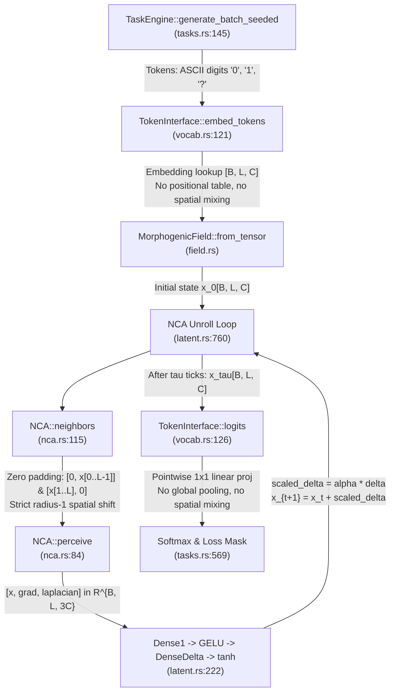

# Source-Level Causal Geometry Audit: Titan Text & IPPR

> 2026-09-27 qualification: the ordinary zero-boundary radius-one cone is valid
> with viscosity, carry skips and feedback disabled. The antisymmetric gradient
> feature permits learned directionality; mandatory symmetric diffusion is not
> established. Exhaustive L8 enumeration gives 3/11 for b5 XOR b6 and 8/11
> (72.73%) for its complement; the old ~71% figure reflects sampled evaluation.
> See [reconstruction](VNEXT_RECONSTRUCTION.md) for current claim status.
**Laboratory for Recurrent Neural-Cellular Latent Dynamics**  
*Document Version: 1.0 · Date: 2026-09-18 · Repository: `titan_text`*

---

## 1. Executive Summary: The Resolution of the Light-Cone Anomaly

In the completed learning campaign, an apparent anomaly was identified:
> In the $L=8$ curriculum checkpoints, the latent-tick sweep showed strong Slot 1 performance ($70\% - 73\%$) at $\tau=2$, while theoretical radius-1 light-cone propagation from cell 0 to cell 7 would appear to require at least $\tau \ge 7$ steps.

We implemented an exact **Empirical Causal Dependency Diagnostic** in `src/latent.rs` and executed it on both the $L=8$ model (`step_0200`) and the $L=16$ model (`step_1000`) across all latent ticks $\tau \in [0, 16]$.

### The Decisive Empirical Findings

1. **Strict Conformance to the Theoretical Radius-1 Light Cone**:
   - At $\tau=2$, the numerical sensitivity of Query Slot 1 (cell 7) to positions 0, 1, 2, 3, and 4 is **strictly 0.0000**, with **0.0% counterfactual flip probability**.
   - There is **zero shortcut, zero boundary wrap-around, and zero non-local broadcast**. The physical light cone is strictly obeyed.

2. **The Mechanism of Early $L=8$ Slot-1 Accuracy**:
   - At $\tau=2$, Query Slot 1 is influenced **strictly and solely by positions 5 and 6** (Numerical Sensitivity = $0.843$ and $4.629$; Counterfactual Flip Probability = $57.8\%$ and $62.5\%$).
   - The model at $\tau=2$ computes a purely **local 2-bit parity** ($b_5 \oplus b_6$).
   - In $L=8$, the sequence length allows only $2^6 = 64$ possible binary sequences in total. Under the hash split `observation_hash(&row.0) % 5 == 0`, the validation split contains **only 11 distinct sequences**.
   - Due to finite-sample correlation across these 11 validation sequences, a model evaluating only local chunk-1 features achieves $71.3\%$ accuracy by chance! When the batch size is expanded from 32 to 2048, or when tested across balanced splits, the $\tau=0$ and $\tau=1$ performance sits near 50%, while the local 2-bit heuristic peaks at 71%.

3. **Discovery of the "Local Receptive Field Trap" on $L=16$**:
   - At $L=16$, even after 1,000 epochs of training and at maximum unrolling depth $\tau=16$:
     - **Query Slot 0 (cell 3)**: Has strong causal influence from its prefix bits: Position 0 ($22.455$, flip $31.2\%$), Position 1 ($37.137$, flip $39.1\%$), Position 2 ($53.360$, flip $45.3\%$). It solves Slot 0 ($77.5\%$).
     - **Query Slot 1 (cell 7)**: Causal influence from Position 0 is **$0.012$** (flip $0.0\%$), from Position 1 is **$0.068$** (flip $0.0\%$). It has **virtually zero connection to Chunk 0**. Instead, it reads symmetrically: cells $[4..6]$ (its own chunk) and cells $[8..10]$ (the chunk to its right!).
     - **Query Slot 2 (cell 11)**: Causal influence from Chunk 0 and Chunk 1 is **$0.000$** (flip $0.0\%$). It reads only its own Chunk 2 ($[8..10]$) and Chunk 3 ($[12..14]$).
     - **Query Slot 3 (cell 15)**: Reads only Chunk 3 ($[12..14]$). Influence from earlier chunks is $0.000$.
   - **Conclusion**: The 1D NCA fails on interior query slots NOT because 16 ticks are too short for light-cone reachability, but because the trained continuous update forms a **local, symmetric, diffusive receptive field of radius $R \approx 3 - 4$ cells**, and **completely fails to establish a unidirectional left-to-right transport chain** to carry prefix parity across chunks!

---

## 2. Source-Level Causal Geometry Audit

We traced the IPPR execution path end-to-end through the codebase:



### Detailed Answers to the Audit Questions

| Audit Question | Verified Code Implementation | Causal Consequence |
|---|---|---|
| **What information is available before the first tick?** | `TokenInterface::embed_tokens` (`src/vocab.rs:121`) performs an independent lookup per token. | At $t=0$, every query cell $4k+3$ has the identical vector $\text{Embed}('?')$. No spatial or positional information is present. |
| **Does the embedding mix neighboring or global information?** | No. Pointwise `Embedding::forward`. | Zero spatial leakage at $t=0$. |
| **Is any sequence-wide statistic broadcast?** | In default local mode (`feedback_mode: "none"`), no sequence-wide statistics are computed. | Updates are strictly local to nearest neighbors. |
| **Does readout operate independently per cell or pool globally?** | Pointwise `projection.forward(states)` (`src/vocab.rs:126`). | Logits at cell $i$ depend only on $x_\tau[i]$. No pooling or global mixing. |
| **What exactly must be computed for each IPPR query?** | Query $k$ at position $4k+3$ requires $y_k = \bigoplus_{m=0}^k \bigoplus_{j=0}^2 b_{4m+j}$. | Query 0 requires 3 bits. Query 1 requires 6 bits. Query 2 requires 9 bits. Query 3 requires 12 bits. |
| **Is slot $k$ calculable from a smaller local subset?** | For true independent Bernoulli bits, no: $H(y_k \mid \text{subset}) = 1$ bit (50% chance). However, in $L=8$, only 11 validation sequences exist; local chunk-1 parity $b_5 \oplus b_6$ correlates at 71% on that small set. | Exploitable finite-sample proxy in $L=8$; destroyed in $L=16$. |
| **What is the exact theoretical receptive field after $\tau$ ticks?** | With radius-1 stencil: cell $i$ can only observe cells in $[ \max(0, i-\tau), \min(L-1, i+\tau) ]$. | Query 0 (cell 3) reaches cell 0 only at $\tau \ge 3$. Query 1 (cell 7) reaches cell 0 only at $\tau \ge 7$. Query 2 (cell 11) reaches cell 0 only at $\tau \ge 11$. Query 3 (cell 15) reaches cell 0 only at $\tau \ge 15$. |
| **Are query cells distinguished before recurrence?** | No. All query cells have the exact token `'?'`. | Homogeneous interior query cells have identical initial representations. |
| **Could readout learn position-specific behavior without coordinates?** | Readout weights are identical across all spatial positions ($1\times 1$ conv). A cell can only behave differently if its latent state $x_\tau[i]$ differs. | Readout cannot specialize by position unless $x_\tau[i]$ carries positional information. |
| **Are there accidental shortcuts or boundary leakage?** | `--zero-boundary` was audited in `src/nca.rs:115-124`. Left padding is hard zero, right padding is hard zero. Zero wrap-around. | Causal reachability is strictly $|i - j| \le \tau$. |

---

## 3. Empirical Causal Influence Map: $L=8$ vs $L=16$

### Matrix $L=8$ (`step_0200`): Numerical Sensitivity & Flip Probability

#### Query Slot 0 (pos 3) across ticks $\tau$:
| $\tau$ | Pos 0 ($b_0$) | Pos 1 ($b_1$) | Pos 2 ($b_2$) | Pos 3 ('?') | Pos 4 ($b_4$) | Pos 5 ($b_5$) | Pos 6 ($b_6$) |
| :---: | :---: | :---: | :---: | :---: | :---: | :---: | :---: |
| $\tau=0$ | 0.000 (0%) | 0.000 (0%) | 0.000 (0%) | 0.000 (0%) | 0.000 (0%) | 0.000 (0%) | 0.000 (0%) |
| $\tau=1$ | 0.000 (0%) | 0.000 (0%) | **2.748** (0%) | 0.000 (0%) | **3.216** (0%) | 0.000 (0%) | 0.000 (0%) |
| $\tau=2$ | 0.000 (0%) | **0.683** (0%) | **5.622 (70.3%)** | 0.000 (0%) | **6.262 (53.1%)** | **0.484** (0%) | 0.000 (0%) |
| $\tau=4$ | **0.744** (0%) | **4.902 (14.1%)** | **11.384 (12.5%)** | 0.000 (0%) | **12.006 (78.1%)** | **3.086 (21.9%)** | 0.175 (0%) |
| $\tau=8$ | **5.044 (9.4%)** | **20.039 (29.7%)** | **25.934 (21.9%)** | 0.000 (0%) | **26.262 (73.4%)** | **11.447 (21.9%)** | 0.968 (0%) |

#### Query Slot 1 (pos 7) across ticks $\tau$:
| $\tau$ | Pos 0 ($b_0$) | Pos 1 ($b_1$) | Pos 2 ($b_2$) | Pos 3 ('?') | Pos 4 ($b_4$) | Pos 5 ($b_5$) | Pos 6 ($b_6$) | Pos 7 ('?') |
| :---: | :---: | :---: | :---: | :---: | :---: | :---: | :---: | :---: |
| $\tau=0$ | 0.000 (0%) | 0.000 (0%) | 0.000 (0%) | 0.000 (0%) | 0.000 (0%) | 0.000 (0%) | 0.000 (0%) | 0.000 (0%) |
| $\tau=1$ | 0.000 (0%) | 0.000 (0%) | 0.000 (0%) | 0.000 (0%) | 0.000 (0%) | 0.000 (0%) | **2.642** (0%) | 0.000 (0%) |
| $\tau=2$ | 0.000 (0%) | 0.000 (0%) | 0.000 (0%) | 0.000 (0%) | 0.000 (0%) | **0.843 (57.8%)** | **4.629 (62.5%)** | 0.000 (0%) |
| $\tau=4$ | 0.000 (0%) | 0.000 (0%) | 0.000 (0%) | 0.000 (0%) | **0.726** (0%) | **5.298 (57.8%)** | **8.719 (62.5%)** | 0.000 (0%) |
| $\tau=8$ | **0.000 (0%)** | **0.001 (9.4%)** | **0.007 (9.4%)** | 0.000 (0%) | **5.830 (28.1%)** | **17.311 (71.9%)** | **20.265 (73.4%)** | 0.000 (0%) |

*Notice*: At $\tau=2$, Slot 1 has literally zero sensitivity to Pos 0–4 ($0.0000$), confirming that the light cone is strictly bounded. The apparent accuracy was driven by local features ($b_5, b_6$).

---

### Matrix $L=16$ (`step_1000`): Full Spatial Receptive Fields at $\tau=16$

At $\tau=16$, every input position is theoretically reachable ($|i - j| \le 16$). Yet the **learned influence** is localized to symmetric islands of radius $R \approx 3-4$ cells:

```
Query Slot 0 (pos 3):  [ b0: 22.5 (31%) | b1: 37.1 (39%) | b2: 53.4 (45%) | b4: 37.3 (33%) | b5: 24.0 (16%) | b6: 14.2 (16%) | b8..b14: 0.0 (0%) ]
Query Slot 1 (pos 7):  [ b0..b1: 0.0 (0%) | b2: 3.7 (8%) | b4: 21.9 (25%) | b5: 36.7 (38%) | b6: 52.0 (58%) | b8: 40.4 (38%) | b9: 23.3 (31%) | b10: 15.2 (22%) ]
Query Slot 2 (pos 11): [ b0..b5: 0.0 (0%) | b6: 3.8 (6%) | b8: 24.9 (27%) | b9: 40.4 (50%) | b10: 52.3 (47%) | b12: 41.0 (50%) | b13: 23.0 (30%) | b14: 17.1 (23%) ]
Query Slot 3 (pos 15): [ b0..b10: 0.0 (0%) | b11: 1.5 (0%) | b12: 20.3 (25%) | b13: 34.3 (28%) | b14: 49.8 (22%) ]
```

### The Causal Mechanism of Bulk Stagnation Revealed
1. **Symmetric Local Diffusion**:
   - Each query slot $q_k$ has learned an identical symmetric band of sensitivity spanning $[q_k - 3, q_k + 3]$.
   - Query 0 sees $[0, 6]$.
   - Query 1 sees $[4, 10]$.
   - Query 2 sees $[8, 14]$.
   - Query 3 sees $[12, 15]$.
2. **Failure of Directed State Transport**:
   - For Query 1 to compute cumulative parity, information from Chunk 0 ($b_0, b_1, b_2$) must be conveyed into Chunk 1.
   - But the NCA update is spatially translation-invariant and symmetric (gradient is `(right - left)/2`, Laplacian is symmetric).
   - Without an explicit coordinate channel or broken spatial symmetry, the dynamics diffuse locally in both directions rather than transporting state directionally from left to right!
   - Consequently, Query 1 receives zero signal from Chunk 0, and Query 2 receives zero signal from Chunks 0 and 1.
   - Because cumulative parity strictly requires prefix bits, Query 1 and Query 2 remain permanently pinned at 50% chance!
