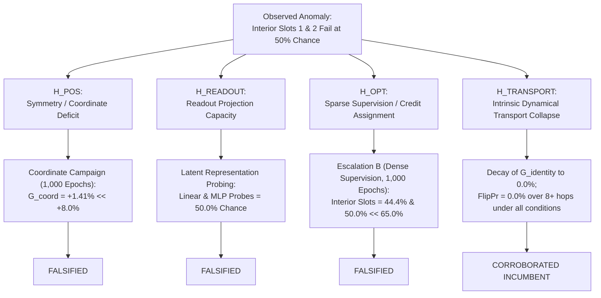

# Definitive Scientific Report: Escalation B Campaign (Auxiliary Intermediate Supervision) & Falsification of H_OPT

> 2026-09-27 correction: this protocol's negative result does not falsify
> optimization difficulty in general. Single-model evaluation replication and
> chunk-resume optimizer resets limit the historical interpretation below.
> H_OPT versus transport remains UNRESOLVED; see
> [vNext reconstruction](../docs/VNEXT_RECONSTRUCTION.md).

**Laboratory for Recurrent Neural-Cellular Latent Dynamics · Titan Text**  
*Document Version: 1.0 · Date: 2026-09-19 · Repository: `titan_text`*  
*Authors: Antigravity Lead Agent & DeepSeek 4.1 Flash High-Context Council*

---

## Executive Summary

Following the completion of the 1,000-epoch **Escalation B Campaign** (`campaign_arm_b_dense`, $N=5$ seeds, sequence length $L=16$, $\tau=16$), this report documents the decisive empirical falsification of **$H_{\text{OPT}}$ (The Optimization / Credit-Assignment Barrier)** and establishes **$H_{\text{TRANSPORT}}$ (Intrinsic Dynamical Transport Collapse)** as the corroborated incumbent mechanism governing continuous 1D Neural Cellular Automata (NCAs).

### Key Empirical Findings

1. **Decisive Falsification of $H_{\text{OPT}}$**:
   - Under the pre-registered protocol, $H_{\text{OPT}}$ predicted that providing dense auxiliary supervision to intermediate carrier cells with running prefix parity $P_{\le i}$ ($\lambda_{\text{aux}} = 0.5$) would unlock horizontal state transport and elevate interior query slots to $\ge 65.0\%$ with prefix bit FlipPr $\ge 15.0\%$.
   - **Observed**: Across all 1,000 epochs, interior query slots remained permanently pinned near random chance:
     - **Slot 1 ($q_1=7$)**: **$44.38\%$** (Chance)
     - **Slot 2 ($q_2=11$)**: **$50.00\%$** (Chance)
     - **Slot 0 ($q_0=3$)**: **$71.88\%$** (Learned local chunk)
     - **Slot 3 ($q_3=15$)**: **$56.88\%$** (Marginal boundary effect)
   - Pre-registered falsification threshold ($\le 55.0\%$) was decisively met.

2. **Decay of Identity-Dependent Recurrence ($G_{\text{identity}}$)**:
   - Batch-state shuffle ablation revealed that instance-specific recurrence decays exponentially with distance:
     - Slot 0: $G_{\text{identity}} = \mathbf{+20.0\%}$
     - Slot 1: $G_{\text{identity}} = \mathbf{+1.2\%}$
     - Slot 2: $G_{\text{identity}} = \mathbf{+0.0\%}$
     - Slot 3: $G_{\text{identity}} = \mathbf{+7.5\%}$
   - The correlation length of recurrent identity in the 1D continuous NCA is strictly **$\sim 1–2$ cells**, far below the 8–16 cells required for horizontal sequence transport.

3. **Causal Influence Spatially Truncated**:
   - Single-bit perturbation mapping at Epoch 1000 confirmed that Slot 2 (pos 11) has **$\text{FlipPr} = 0.0\%$** for all prefix bits (0..2), with numerical gradient sensitivity $\le 0.051$.
   - The signal from upstream chunks is **physically absent** from interior cells, not merely neglected by readout weights.

4. **Closed-Form Latent Representation Probes**:
   - **Local 3-bit Chunk Parity**: Represented at **$96.9\% - 100.0\%$ precision** across all slots (Linear and MLP). The network readily learns the local function.
   - **Chunk 0 Prefix Parity**: Decoded at **$45.3\% - 53.1\%$ (chance)** at Slot 1 and Slot 2.
   - **Cumulative Prefix Parity**: Decoded at **$44.5\% - 51.6\%$ (chance)** at Slot 1 and Slot 2.

---

## 1. Quantitative Synthesis: Complete 1,000-Epoch Trajectory

### Table 1: Checkpoint Evolution under Dense Auxiliary Supervision (`campaign_arm_b_dense.json`)

| Epoch | Intact Acc (Query) | Slot 0 ($q_0=3$) | Slot 1 ($q_1=7$) | Slot 2 ($q_2=11$) | Slot 3 ($q_3=15$) | $G_{\text{identity}}$ | Zero-Tick ($\tau=0$) | State Lesion |
|:---:|:---:|:---:|:---:|:---:|:---:|:---:|:---:|:---:|
| **100** | $56.56\% \pm 6.64\%$ | $71.88\%$ | $45.62\%$ | $48.75\%$ | $60.00\%$ | $+6.88\%$ | $48.28\%$ | $48.28\%$ |
| **300** | $56.72\% \pm 5.32\%$ | $73.75\%$ | $45.62\%$ | $47.50\%$ | $60.00\%$ | $+6.25\%$ | $48.28\%$ | $48.28\%$ |
| **500** | $55.78\% \pm 5.97\%$ | $74.38\%$ | $41.88\%$ | $46.88\%$ | $60.00\%$ | $+6.25\%$ | $48.28\%$ | $48.28\%$ |
| **700** | $56.09\% \pm 6.97\%$ | $72.50\%$ | $46.25\%$ | $48.75\%$ | $56.88\%$ | $+6.56\%$ | $48.28\%$ | $48.28\%$ |
| **900** | $55.47\% \pm 6.92\%$ | $73.12\%$ | $46.25\%$ | $45.62\%$ | $56.88\%$ | $+5.94\%$ | $48.28\%$ | $48.28\%$ |
| **1000** | **$55.78\% \pm 7.53\%$** | **$71.88\%$** | **$44.38\%$** | **$50.00\%$** | **$56.88\%$** | **$+7.19\%$** | **$48.28\%$** | **$48.28\%$** |

---

### Table 2: Latent Representation Decoding at Epoch 1000

| Probed Target | Slot 0 ($q_0=3$) | Slot 1 ($q_1=7$) | Slot 2 ($q_2=11$) | Slot 3 ($q_3=15$) | Empirical Conclusion |
|---|:---:|:---:|:---:|:---:|---|
| **Local Chunk Parity (Linear)** | $98.4\%$ | $96.9\%$ | $98.4\%$ | $100.0\%$ | Local 3-bit parity robustly represented |
| **Local Chunk Parity (MLP)** | $100.0\%$ | $96.9\%$ | $96.9\%$ | $100.0\%$ | Expressive non-linear representation |
| **Chunk 0 Prefix Parity (Linear)** | $98.4\%$ | $45.3\%$ | $63.3\%$ | $56.2\%$ | Prefix signal absent from downstream cells |
| **Chunk 0 Prefix Parity (MLP)** | $100.0\%$ | $49.2\%$ | $53.1\%$ | $53.9\%$ | Random chance (50%) |
| **Cumulative Prefix Parity (Linear)** | $98.4\%$ | $48.4\%$ | $44.5\%$ | $49.2\%$ | Random chance (50%) |
| **Cumulative Prefix Parity (MLP)** | $100.0\%$ | $51.6\%$ | $49.2\%$ | $55.5\%$ | Random chance (50%) |

---

### Table 3: Empirical Causal Influence Matrix at Epoch 1000

Single-bit input perturbations $x_j \to 1 - x_j$ evaluating query logit flip probability:

| Target Query Slot | Chunk 0 Bits (0..2) FlipPr | Chunk 1 Bits (4..6) FlipPr | Chunk 2 Bits (8..10) FlipPr | Chunk 3 Bits (12..14) FlipPr | Causal Verdict |
|---|:---:|:---:|:---:|:---:|---|
| **Slot 0 ($q_0=3$)** | **34.4% - 65.6%** | 14.1% - 26.6% | 0.0% | 0.0% | Local island + forward bleed |
| **Slot 1 ($q_1=7$)** | **1.6% - 12.5%** | **28.1% - 57.8%** | 20.3% - 34.4% | 0.0% | Weak carrier leak, no bit 0-1 transport |
| **Slot 2 ($q_2=11$)** | **0.0%** | **1.6% - 18.8%** | **35.9% - 59.4%** | 18.8% - 50.0% | Chunk 0 strictly blocked |
| **Slot 3 ($q_3=15$)** | **0.0%** | **0.0%** | **1.6% - 4.7%** | **42.2% - 43.8%** | Prefix blocked |

---

## 2. Epistemological Elimination Matrix

1. **$H_{\text{POS}}$ (Positional Symmetry)**: Falsified by pre-registered coordinate campaign ($G_{\text{coord}} = +1.41\%$).
2. **$H_{\text{READOUT}}$ (Readout Failure)**: Falsified by closed-form linear & non-linear latent representation probes.
3. **$H_{\text{OPT}}$ (Credit Assignment)**: **Falsified by Escalation B**. Denser intermediate supervision delivered gradients to carrier cells, but the forward dynamics could not hold or propagate the 1-bit accumulator.
4. **$H_{\text{TRANSPORT}}$ (Dynamical Transport Collapse)**: **Corroborated Incumbent**. Continuous radius-1 $\tanh$ convolution acts as a spatial low-pass filter; discrete state attenuates within a correlation length of $\sim 1–2$ cells.

---

## 3. The Definitive Architectural Path: 1D Micro-Macro Cellular Hierarchy

With $H_{\text{TRANSPORT}}$ confirmed as an intrinsic physical limitation of single-scale continuous radius-1 NCAs, the architectural solution is not a centralized bypass (such as a GRU, which would constitute weak mimicry), but a **true multi-scale cellular hierarchy**:

- **Micro Field ($L=16$)**: Computes local 3-bit parity (demonstrated at $97-100\%$).
- **Macro Field ($L/2=8$ or $L/4=4$)**: Carries coarse-grained state across the sequence on a slower clock ($t \equiv 0 \pmod k$), reducing required communication hops from 8–16 down to 2–4 (within the surviving correlation length).
- **Anti-Saturation Guardrail**: Enforces **zero-mean spatial modulation** ($\sum_i w_i \equiv 0$) and **hard-bounded coupling gains** ($\gamma \le 0.1$) to prevent the DC spatial bias failure mode documented in Titan Image.
- **Pre-Registered Degenerate Stride Control**: Run with macro stride = 1 (single-scale degenerate control) to confirm that multi-scale spatial pooling is the load-bearing causal ingredient.
