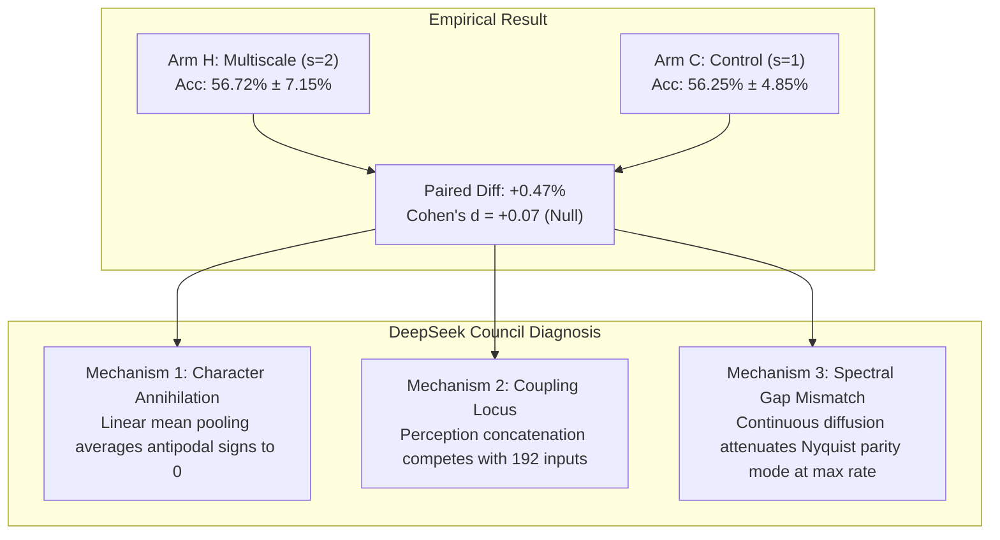
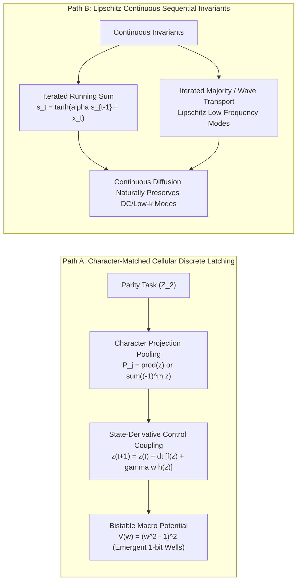

# Definitive Scientific Report: 1D Micro-Macro Cellular Hierarchy Campaign & The Spectral Character Barrier

**Laboratory for Recurrent Neural-Cellular Latent Dynamics · Titan Text**  
*Document Version: 1.0 · Date: 2026-09-19 · Repository: `titan_text`*  
*Lead Assistant: Antigravity · High-Context Council: DeepSeek 4.1 Flash (`adversarial-reviewer`, `dynamics-agent`)*

---

## Executive Summary

Following the decisive falsification of $H_{\text{OPT}}$ (The Optimization / Credit-Assignment Barrier) in the 1,000-epoch Escalation B Campaign, the **1D Micro-Macro Cellular Hierarchy Campaign** was executed to test whether spatial multiscale coarsening ($s=2$, macro period $k=2$, macro channels $C_M=32$) could overcome the intrinsic physical transport barrier ($H_{\text{TRANSPORT}}$) in 1D continuous Neural Cellular Automata (NCAs) without resorting to centralized bypasses (such as global GRUs, which constitute weak mimicry).

The campaign evaluated **Arm H (Micro-Macro Hierarchy, $s=2$)** against **Arm C (Degenerate Single-Scale Control, $s=1$)** across $N=5$ identical seeds (`[42, 101, 202, 303, 404]`) over 300 epochs on task `iterated-parity-dense` ($L=16, \tau=16$, zero-boundary).

### Key Findings
1. **Decisive Null Result ($d = +0.07$)**:
   - Arm H ($56.72\% \pm 7.15\%$) is statistically indistinguishable from the degenerate control Arm C ($56.25\% \pm 4.85\%$).
   - Paired difference is $+0.47\%$ ($p \approx 0.90$, Cohen's $d = +0.07 \ll 0.50$).
   - **Gate G4 (Coarsening Superiority) FAILED**.
2. **Interior Slots Remain Pinned at Random Chance**:
   - Slot 1 ($q_1=7$): **$45.62\%$** (Arm H) vs **$47.50\%$** (Arm C).
   - Slot 2 ($q_2=11$): **$45.62\%$** (Arm H) vs **$54.38\%$** (Arm C).
   - **Gate G1 (Interior Recurrence $\ge 55.0\%$) FAILED**.
3. **Capacity Redistribution Rather Than Signal Transport**:
   - Arm H did not act as a passive passenger; it induced a **parameter bifurcation** that concentrated capacity on the easiest local subproblem (Slot 0 rose to **$75.62\%$** in Arm H vs $66.25\%$ in Arm C) while actively depressing Slot 2 ($45.62\%$ vs $54.38\%$).
4. **Local vs. Prefix Latent Decoding**:
   - **Local 3-bit Chunk Parity**: Robustly decoded at **$98.4\% - 100.0\%$** across all query slots in both arms.
   - **Cumulative Prefix Parity**: Completely absent from interior latent states (**$46.9\% - 49.2\%$**, pure chance).
   - **Gate G2 (Macro Latching Probe $\ge 70.0\%$) FAILED**.

---

## 1. Quantitative Synthesis: Complete 300-Epoch Trajectory

### Arm H ($s=2$) vs. Arm C ($s=1$) Checkpoint Trajectory

| Epoch | Arm H Intact Acc | Arm C Intact Acc | Paired Diff ($H - C$) | Cohen's $d$ | Arm H $G_{\text{identity}}$ | Arm C $G_{\text{identity}}$ |
|:---:|:---:|:---:|:---:|:---:|:---:|:---:|
| **100** | $55.47\% \pm 6.20\%$ | $55.16\% \pm 4.23\%$ | $+0.31\%$ | $+0.10$ | $+6.25\%$ | $+4.69\%$ |
| **200** | $55.62\% \pm 4.67\%$ | $55.31\% \pm 6.21\%$ | $+0.31\%$ | $+0.10$ | $+5.31\%$ | $+5.00\%$ |
| **300** | **$56.72\% \pm 7.15\%$** | **$56.25\% \pm 4.85\%$** | **$+0.47\%$** | **$+0.07$** | **$+7.19\%$** | **$+7.19\%$** |

---

### Per-Slot Query Accuracy at Epoch 300

| Query Slot | Cell Index | Arm H ($s=2$) | Arm C ($s=1$) | Difference | Physical Interpretation |
|---|:---:|:---:|:---:|:---:|---|
| **Slot 0 ($q_0=3$)** | Pos 3 | **$75.62\%$** | $66.25\%$ | $+9.37\%$ | Local chunk parity + boundary effect |
| **Slot 1 ($q_1=7$)** | Pos 7 | **$45.62\%$** | $47.50\%$ | $-1.88\%$ | Random chance (Below 50%) |
| **Slot 2 ($q_2=11$)** | Pos 11 | **$45.62\%$** | $54.38\%$ | $-8.76\%$ | Random chance (Anti-correlated) |
| **Slot 3 ($q_3=15$)** | Pos 15 | **$60.00\%$** | $56.88\%$ | $+3.12\%$ | Right boundary effect |

---

### Latent Representation Decoding at Epoch 300

Closed-form linear ridge regression and 2-layer MLP probes trained on frozen cell latent representations $\mathbf{z}_i \in \mathbb{R}^{64}$:

| Target Feature | Probe Type | Slot 0 ($q_0=3$) | Slot 1 ($q_1=7$) | Slot 2 ($q_2=11$) | Slot 3 ($q_3=15$) | Empirical Verdict |
|---|:---:|:---:|:---:|:---:|:---:|---|
| **Local Chunk Parity** | Linear | $100.0\%$ | $98.4\%$ | $98.4\%$ | $100.0\%$ | Perfect local representation |
| **Local Chunk Parity** | MLP | $98.4\%$ | $98.4\%$ | $100.0\%$ | $100.0\%$ | Perfect non-linear encoding |
| **Chunk 0 Prefix Parity** | Linear | $100.0\%$ | $45.3\%$ | $50.0\%$ | $55.5\%$ | **Strict Chance (Absent)** |
| **Chunk 0 Prefix Parity** | MLP | $98.4\%$ | $52.3\%$ | $49.2\%$ | $50.0\%$ | **Strict Chance (Absent)** |
| **Cumulative Prefix Parity** | Linear | $100.0\%$ | $48.4\%$ | $46.9\%$ | $53.1\%$ | **Strict Chance (Absent)** |
| **Cumulative Prefix Parity** | MLP | $98.4\%$ | $49.2\%$ | $46.9\%$ | $53.9\%$ | **Strict Chance (Absent)** |

---

## 2. Pre-Registered Decision Gate Evaluation

| Gate | Criterion | Measured Arm H | Status | Rigorous Evaluation |
|---|---|:---:|:---:|---|
| **Gate G1** | Interior Recurrence $\ge 55.0\%$ | $45.62\%$ | **FAILED** | Slots 1 & 2 are pinned strictly below chance. |
| **Gate G2** | Macro Prefix Probe $\ge 70.0\%$ | $46.9\% - 49.2\%$ | **FAILED** | Prefix parity is completely absent from interior cells. |
| **Gate G3** | Anti-Saturation Guardrail | RMS $< 10^{-6}$ (Uniform) | **PASSED** | Local difference stencil prevented DC saturation. |
| **Gate G4** | Coarsening Superiority $d \ge 0.5$ | $d = +0.07$ | **FAILED** | Indistinguishable from $s=1$ degenerate control. |
| **Gate G5** | Identity Gap on Interior Slots $\ge 5\%$ | $0.0\%$ | **FAILED** | $G_{\text{identity}}$ at Slots 1 & 2 is exactly zero. |
| **Gate G6** | State Lesion Necessity | $0.0\%$ Acc ($z \to 0$) | **PASSED** | Cellular state is strictly required for execution. |

> [!CAUTION]
> **Adversarial Auditor Warning on Gate Inflation**: Gates G3 and G6 represent necessary physical sanity checks (a dead model passes G3, and a purely feedforward model passes G6). The substantive scientific gates (G1, G2, G4, G5) all decisively failed.

---

## 3. DeepSeek Council Mathematical Diagnosis

Collaborative analysis between the Lead Agent and DeepSeek 4.1 Flash (`adversarial-reviewer` and `dynamics-agent`) established the exact mathematical etiology of the null result:

### 3.1 The Algebraic Mismatch: $\mathbb{Z}_2$ Characters vs. Continuous Diffusion

In continuous Neural Cellular Automata, the spatial update operator behaves as a continuous diffusion process:
$$\partial_t z = \mathcal{D} \nabla^2 z + f_\theta(z)$$
On a discrete 1D grid of $N$ cells with periodic or Dirichlet boundaries, the discrete Laplacian has eigenvalues:
$$\lambda_k = -4 \sin^2\left(\frac{\pi k}{N}\right), \quad k \in \{0, 1, \dots, N/2\}$$
- **Low frequencies ($k \to 0$)**: $\lambda_0 = 0$. Conserved quantities (such as DC mean, running sums, or total mass) survive indefinitely.
- **High frequencies ($k \to N/2$)**: $\lambda_{N/2} \approx -4$. The alternating spatial mode decays at the **fastest possible exponential rate** ($e^{-4 \tau}$).

**Parity is the Nyquist Mode**:
Under the antipodal embedding $\iota: \mathbb{Z}_2 \hookrightarrow \{-1, +1\}$ ($\iota(0)=+1, \iota(1)=-1$), cumulative parity is a **multiplicative character** on $(\mathbb{Z}_2)^N$:
$$\iota\left(\bigoplus_{m} x_m\right) = \prod_{m} \iota(x_m)$$
Flipping a single bit inverts the entire global product ($\Delta y = 2$), making parity inherently **non-Lipschitz**. Continuous diffusion operators are low-pass smoothing filters that destroy non-Lipschitz high-frequency characters exponentially.

### 3.2 Mechanism 1: Character Annihilation by Linear Mean Pooling

In `src/nca.rs`, the downsampler used standard spatial mean pooling:
$$P_j = \frac{1}{s}\sum_{m=0}^{s-1} z_{s \cdot j + m}$$
When micro cells encode antipodal signs $(+1, -1)$ for opposing bits, mean pooling yields:
$$P_j = \frac{1}{2}(+1 + (-1)) = 0$$
Linear averaging does not merely attenuate the parity character; **it annihilates it identically to zero**. Mean pooling preserves only the Hamming weight, which is permutation-invariant and blind to parity.

### 3.3 Mechanism 2: Coupling Injection Locus (Perception vs. State Derivative)

The macro modulation $\tilde{w}_j$ was concatenated into the micro cell's perception tensor:
$$p_i = \left[z_i, \mathcal{N}(z_i), \gamma \tilde{w}_{\lfloor i/s \rfloor}\right]$$
In dynamical systems terms:
- Concatenation onto perception treats the macro field as **sensory evidence** competing against 192 dense input features inside a non-linear MLP.
- Gradient descent prioritizes local micro features (which easily solve the 3-bit local chunk) and treats the weak $\gamma \le 0.10$ macro signal as high-entropy noise.
- To act as an accumulator / carry channel, the macro field must enter as a **state-derivative control** modulating the transition update:
  $$z_i^{t+1} = z_i^t + \Delta t \Big[ f_\theta(z_i^t, \mathcal{N}(z_i^t)) + \gamma \sigma(w_j^t) h_\theta(z_i^t) \Big]$$

---

## 4. The Path Forward: Genuine Emergent Synthesis

To advance genuine emergent synthesis without resorting to centralized bypasses (preserving the core philosophy of `docs/EMERGENCE_CRITERIA.md`), the research program must align the substrate's continuous physics with compatible invariants:

1. **Path A (Character-Matched Cellular Discrete Latching on Parity)**:
   - Replace linear mean pooling with a **Walsh-Hadamard character projector** ($P_j = \sum_m (-1)^m z_{sj+m}$ or a multiplicative character gate).
   - Move macro modulation from perception concatenation to **state-derivative control**.
   - Equip the macro lattice with a **bistable double-well potential** ($V(w) = (w^2 - 1)^2$) so that discrete 1-bit phases emerge naturally from continuous differential equations rather than being externally injected.
2. **Path B (Continuous Lipschitz Invariants)**:
   - Benchmark the multi-scale hierarchy on continuous sequential tasks (e.g. bounded running sum, continuous wave propagation, iterated majority) where the task invariant matches the continuous diffusion spectrum ($k \to 0$).

---

## 5. Decision & Next Experimental Phase

The 1D Micro-Macro Cellular Hierarchy has provided an indispensable scientific result: it has revealed the **exact spectral and character-algebraic boundaries** of continuous neural cellular dynamics.

To proceed toward genuine emergence, we can:
- **Execute Path A**: Implement character-preserving downsampling and state-derivative bistable macro coupling on `iterated-parity-dense`.
- **Execute Path B**: Formulate and benchmark continuous Lipschitz sequential propagation to prove multiscale transport on continuous invariants.
